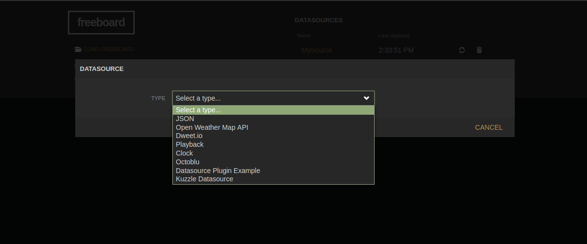
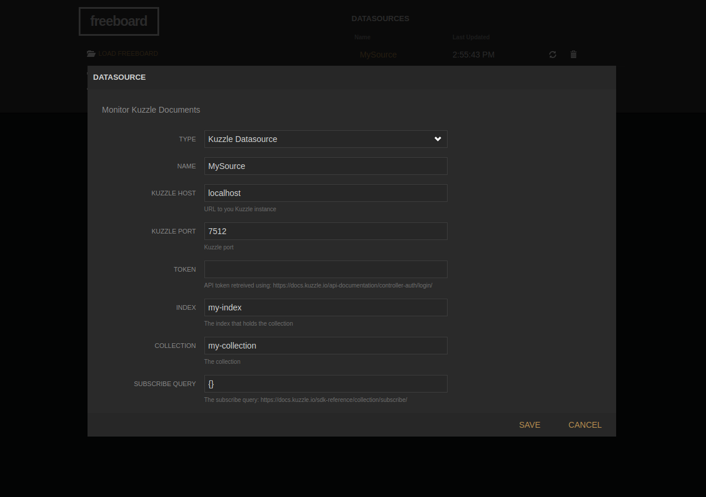

# Kuzzle freeboard plugin

Freeboard plugin to help integrate data from a Kuzzle Server to your Freeboard IoT Dashboard

## Kuzzle Datasource

Kuzzle Datasource freeboard plugin allow to take advantage of [Kuzzle](http://www.kuzzle.io) Realtime capabilities to monitor any realtime parametter of your Kuzzle based IoT application.

For now, Kuzzle Freeboard Datasource plugin is limited to monitoring document when they are **created**, but you could easily adapt it to monitor document when they are **updated**, **deleted**, or **published** for pure realtime documents (documents that are not stored).

This document focuses on using the plugin with *freeboard* running locally, using the development version: `freeboard/index-dev.html`.  You can get it from [Freeboard/freeboard](https://github.com/Freeboard/freeboard). It should take little effort to get the plugin available for online version at [freebord.io](http://www.freeboard.io).

### Enable Kuzzle Datasource Plugin

First you have to make Kuzzle JS sdk available to *freeboard* plugins.
One way to do this, is to *kuzzle-sdk* it to *freeboard* depndencies using *npm*.

In `freeboard` folder enter the following command:

```console
$ npm install kuzzle-sdk
```

Then modify `freeboard/index-dev.html` file to add loading of Kuzzle JS SDK, and Kuzzle DataSource plugin.

``` html
    <script type="text/javascript">
        head.js("lib/js/thirdparty/knockout.js",
                "lib/js/thirdparty/jquery.js",
                "plugins/freeboard/freeboard.widgets.js",
                .
                .
                .
                "examples/plugin_example.js",

                // Make Kuzzle() available
                "node_modules/kuzzle-sdk/dist/kuzzle.js",
                // Load Kuzzle Datasource plugin
                "path-to/..../kuzzle-freeboard-plugin/kuzzle_datasource.js",

                // *** Load more plugins here ***
                function(){
                    $(function()
                    .
                    .
```

You can now check that Kuzzle DataSource plugin is available. Open `freeboard/index-dev.html` in your favorite web browser.
Under **DATASOURCES**, click the **ADD** button. In the dropdown list, you should be able to see **Kuzzle Datasource** entry.



### Kuzzle Datasource Configuration

Once you clicked on **Kuzzle Datasource** entry, you get to the plugin settings screen.



Settings:

| Name | Description |
|----------------------|------|
|Kuzzle host  | The hostname of the machine on which Kuzzle Server instance si running, default is `localhost`. |
| Kuzzle port | The port through which Kuzzle Server is accessible, default is `7512` |
| Token | You can provide a token to be used if anonymous access has been removed. See [Kuzzle login API](https://docs.kuzzle.io/api-documentation/controller-auth/login/) to learn how to generate a JWT encrypted token |
| Index | The Kuzzle *index* that holds the documents your are interested in. |
| Collection | The Kuzzle *collectino* that holds the documents your are interested in. |
| Filter | The filter the document you are interested in must match. Refer to [Koncord documentation](https://docs.kuzzle.io/kuzzle-dsl/essential/koncorde/) for further information about Kuzzle realtime filters. using `{}` as filter, will match any **created** document.|

The Kuzzle Datasource plugin will receive a notification for each **created** document in the specified `index/collection` that matches the `filter`.
